<!-- hero: monochrome ASCII portrait (types in) beside a terminal info panel -->

<h3><code>bobur@github ~ $ ./contributions.sh</code></h3>

 
 

<h3><code>bobur@github ~ $ whoami</code></h3>

<table>
<tr>
<td valign="top"></td>
<td valign="top"></td>
</tr>
</table>

 
 

<h3><code>bobur@github ~ $ ./links.sh</code></h3>

<b>Backend Developer · AI Enthusiast · Open Source Learner</b>

 

