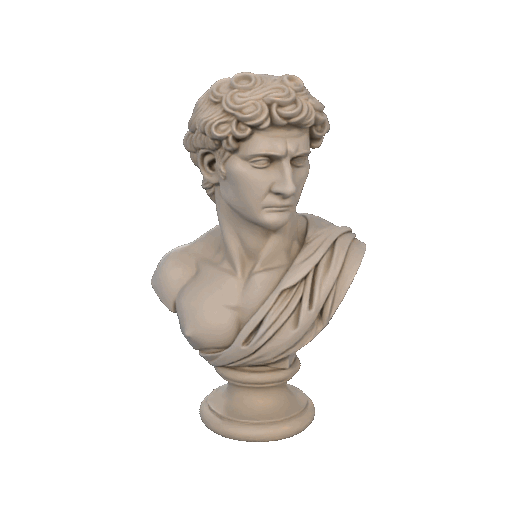

  

    

 

  
  

 

---

 

Hello There! <em><b> I'm Bobur Boboyev </b></em>, a "Software engineer". I build and code things for fun. This GitHub is just where I put the stuff I am learning, building or messing around with. Now I'm working at some little and fun projects to put in practice my knowledge about Python, Django, FastApi and more.

- "Software engineer" who believes great products live at the intersection of clean code and thoughtful design
- i love building websites and apps where design, functionality and even small details matter.
- i enjoy making products that are both practical and visually satisfying.
- always open to learning, picking up new technologies and growing through the work itself
<!-- - i got a site: None -->

 
 
 

---
<h3 align='center'>Some Tools I Have Used and Learned<h3>

  
  
  
  
  
  
  
  
  
  
  
  
  
  

 

<h2>Visitor Count:</h2>

  

